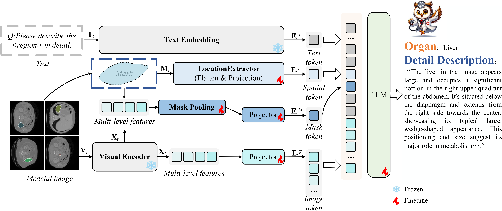

# PLAMi Framework

<div align="center">
    
</div>

## Installation

Clone the repository and set up the environment with all necessary packages using these commands:

```bash
git clone https://github.com/MaochengBai/PLAMi
cd PLAMi
conda create -n plami python=3.10 -y
conda activate plami
pip install --upgrade pip
pip install -e .
pip install -e ".[train]"
pip install flash-attn --no-build-isolation
```
## Demo

To run the demo, navigate to the demo directory and execute app.py. Before starting, ensure you have set the model_path for the model, data_folder for the image data, json_file for the image instructions, and description_type to specify the description format in app.py. Make sure all parameters are correctly configured to match your setup.
```
cd demo
python app.py 
```

## Training

### Stage 1: Image-Text Biomedical Concept Feature Alignment
Utilize the LLaVA training approach to train text-image alignment projectors and refine the `mm_projector`. This stage does not introduce a feature extractor.

### Stage 2: Regional Feature-Text Alignment
- Set `model_name_or_path` to the path of `Mistral-7B-Instruct-v0.2` in `stage2.sh`.
- Set `pretrain_mm_mlp_adapter` to the path of `mm_projector` in `stage2.sh`.
- Run `sh scripts/stage2.sh`.

### Stage 3: End-to-End Fine-Tuning
- Set `model_name_or_path` to the path of `stage2 checkpoint` in `stage2.sh`.
- Set `vision_tower` to the path of `Convnext-large-CLIP-model` in `stage2.sh`.
- Run `sh scripts/stage3.sh`.


## Data

The datasets generated and/or analyzed during the current study are available from the author on reasonable request. The data will be made publicly available after the publication of the paper. If you are interested in accessing the data before then, please contact the author via email at maocheng@stumail.neu.edu.cn.
